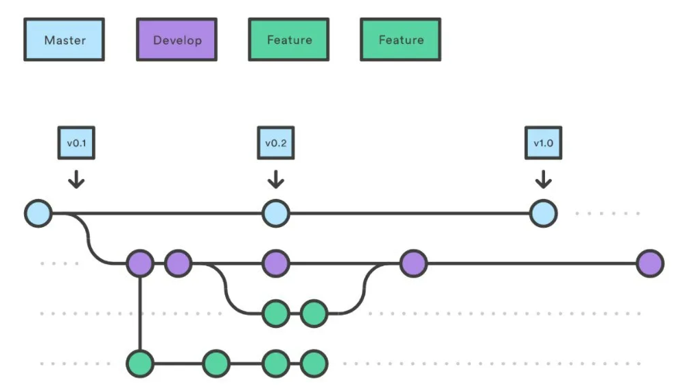

# About

This file describes how to contribute to the repository. Basic idea is to make
short living branches with few commits and make pull request to `dev` branch.

# Detailed description

There is two long living branches `master` and `dev`.

* `master` - is a branch with tested and working code. The commits are only
made from `dev` branch via `pull request`. Usually every commit made to this
branch is with version label.
* `dev` - is the branch where the actual development happens. 

And there are many short living `feature` branches. 

The structure of git flow is shown on image:

    

