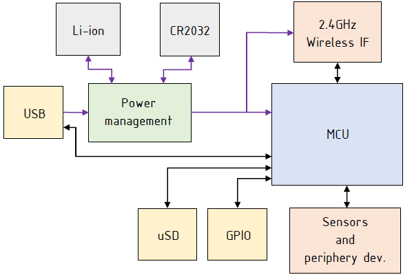
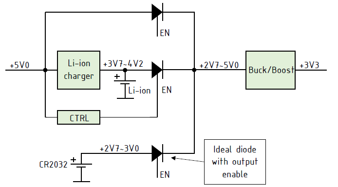

### About

Here are documentation, related to femtoino specification.

### Hardware general description
* USB Type-C power connector with data communication over it
* GPIO expansion pins including analog pins for ADC and DAC
* External Li-ion battery connector, for autonomous operation
* Some on-board sensors if enough space is available (TBD), for example
  the temperature, barometric pressure, humidity, IMU, light sensors, etc.
* 2.4GHz wireless interface for connectivity
* One or more onboard RGB LEDs
* CR2032 battery holder
* One or more micro buttons
* Micro SD card slot if possible
* Possibly some CNC milled case may be developed for this device in future,
  so consider to make usable GPIO expansion pins and wireless antenna connector

Device block diagram:

Power management block should manage Li-ion battery recharge, provide power to
the remaining system devices. All batteries are optional, so power management
block should handle all possible powering schemes by its own. It’s advised to
choose PMIC for such purpose to save space on a PCB. Add two LEDs that indicate
USB power-in and Li-ion battery charging status.

Use ATmega32 MCU with internal USB interface.

Choose low cost 2.4GHz wireless transceiver like nRF24L01+ or similar. Use PCB
antenna and external antenna connector. Antennas may be switched mechanically
or by on PCB RF switch controlled by MCU.

GPIO expansion header should include UART, SPI, TWI, ADC, DAC and I/O pins.

ISP pin header should be placed on PCB.

Use minimum 4-layer PCB stack-up for easier layout, where dedicate two internal
layers for GND/GND or GND/PWR planes.

Use as many sensors as PCB size is capable to hold.

Use minimum two buttons. Hard reset and user button.

Use minimum on RGB LED for indications.

The size of PCB is TBD.

This configuration allows to switch between three types of power sources
automatically. For example, if all power sources are present, then the top
circuit route is active, because the CTRL block disables Li-ion route and
the +5V0 voltage is higher than CR2032 battery voltage, so bottom circuit
route is closed (this is how diode ORing scheme works.).

When there are only batteries present, then due to Li-ion battery voltage is
always higher than CR2032 battery voltage, only the middle route is active,
and so only the Li-ion battery is discharged.

And, obviously, when the only CR2032 battery is left, then it is the only one
which is discharged.

From this we get the following power source priorities:
1. USB +5V0
2. Li-ion
3. CR2032

**NOTE**. The lower number the higher priority.
Buck/Boost voltage converter is used to stabilize output voltage at +3V3 level
based on non-constant input voltage.
